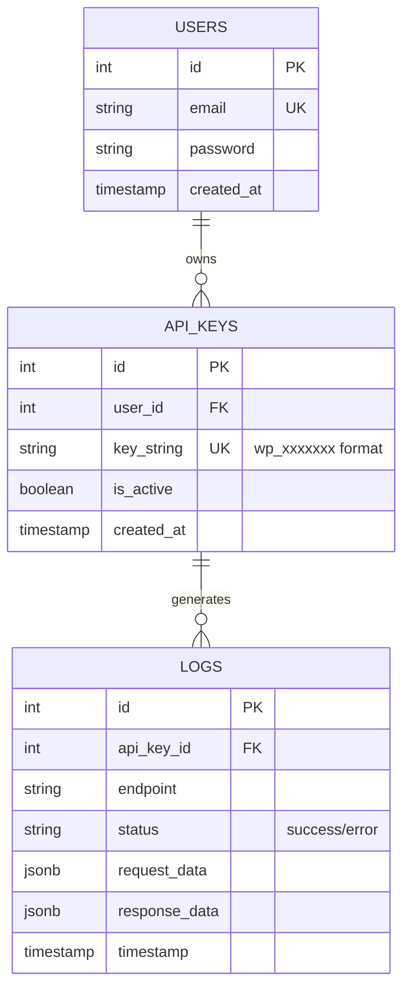
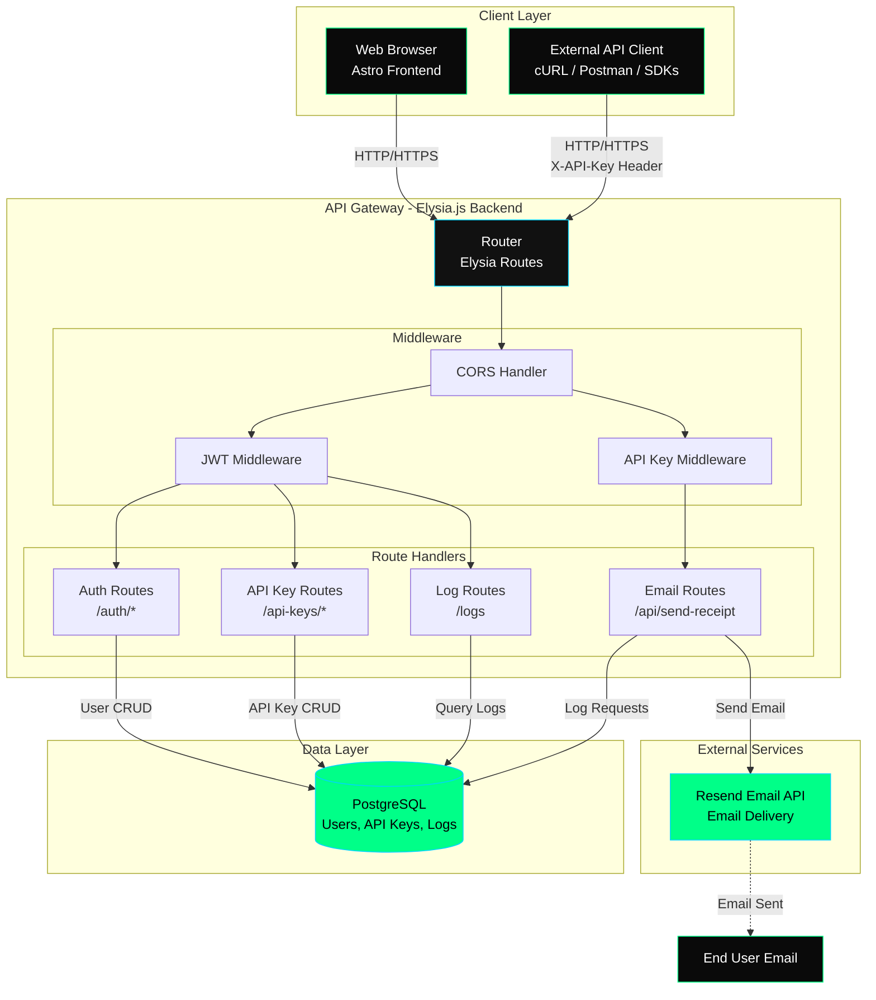
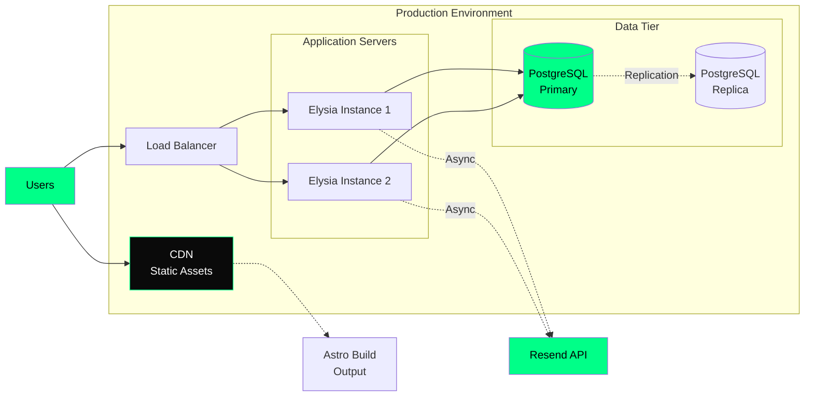

# Architecture Documentation

This document contains architecture diagrams for the Email Receipt API Wrapper system.

## Entity Relationship Diagram (ERD)



**Relationships:**
- One user can have **many API keys** (one-to-many)
- One API key can generate **many log entries** (one-to-many)
- Logs track all API requests made with each key

---

## Request Flow Flowchart

```mermaid
flowchart TD
    Start([Client Request]) --> CheckAuth{Authentication<br/>Type?}
    
    CheckAuth -->|JWT Token| ValidateJWT[Validate JWT Token<br/>from Header]
    CheckAuth -->|API Key| ValidateKey[Validate API Key<br/>from X-API-Key Header]
    
    ValidateJWT --> JWTValid{Valid<br/>JWT?}
    JWTValid -->|No| Error401[Return 401<br/>Unauthorized]
    JWTValid -->|Yes| AuthSuccess[Add User Context]
    
    ValidateKey --> CheckFormat{Valid<br/>Format?}
    CheckFormat -->|No| Error400[Return 400<br/>Invalid Format]
    CheckFormat -->|Yes| CheckDB[Query Database<br/>for API Key]
    
    CheckDB --> KeyExists{Key Exists<br/>& Active?}
    KeyExists -->|No| Error403[Return 403<br/>Invalid Key]
    KeyExists -->|Yes| KeySuccess[Add API Key Context]
    
    AuthSuccess --> ProcessReq[Process Request]
    KeySuccess --> EmailFlow[Email Sending Flow]
    
    EmailFlow --> Template[Generate HTML<br/>Receipt Template]
    Template --> InsertData[Inject Item, Price,<br/>Email Data]
    InsertData --> CallResend[Call Resend API]
    
    CallResend --> ResendOK{Resend<br/>Success?}
    ResendOK -->|No| LogError[Log Error to DB]
    ResendOK -->|Yes| LogSuccess[Log Success to DB]
    
    LogError --> Error500[Return 500<br/>Email Failed]
    LogSuccess --> Success200[Return 200<br/>Email Sent]
    
    ProcessReq --> Response[Return Response]
    
    Error401 --> End([End])
    Error400 --> End
    Error403 --> End
    Error500 --> End
    Success200 --> End
    Response --> End
    
    style Start fill:#00ff88,stroke:#00d4ff,color:#000
    style End fill:#00ff88,stroke:#00d4ff,color:#000
    style Error401 fill:#ff4757,stroke:#333,color:#fff
    style Error400 fill:#ff4757,stroke:#333,color:#fff
    style Error403 fill:#ff4757,stroke:#333,color:#fff
    style Error500 fill:#ff4757,stroke:#333,color:#fff
    style Success200 fill:#00ff88,stroke:#00d4ff,color:#000
    style Template fill:#0a0a0a,stroke:#00ff88
    style CallResend fill:#0a0a0a,stroke:#00ff88
```



---

## System Design Diagram



---

## Data Flow Example: Sending a Receipt Email

1. **Client Request**
   ```http
   POST /api/send-receipt
   X-API-Key: wp_abc123...
   Content-Type: application/json
   
   {
     "item": "Laptop",
     "harga": "5000000",
     "email": "customer@example.com"
   }
   ```

2. **API Key Validation**
   - Extract `wp_abc123...` from `X-API-Key` header
   - Check format with regex: `^wp_[a-z0-9]{32}$`
   - Query database: `SELECT * FROM api_keys WHERE key_string = 'wp_abc123...'`
   - Verify `is_active = true`

3. **Template Generation**
   - Call `generateReceiptHTML({ item: "Laptop", harga: "5000000", email: "..." })`
   - Inject data into HTML template
   - Format currency: `Rp 5.000.000`

4. **Resend Integration**
   ```javascript
   await resend.emails.send({
     from: 'noreply@wrapper.dev',
     to: 'customer@example.com',
     subject: 'Struk Pembelian - Laptop',
     html: generatedHTML
   })
   ```

5. **Logging**
   ```sql
   INSERT INTO logs (api_key_id, endpoint, status, request_data, response_data)
   VALUES (123, '/api/send-receipt', 'success', {...}, {...})
   ```

6. **Response**
   ```json
   {
     "success": true,
     "message": "Receipt sent successfully",
     "data": {
       "emailId": "re_xxxx",
       "recipient": "customer@example.com"
     }
   }
   ```

---

## Security Considerations

### Authentication
- **JWT Tokens**: 7-day expiration, stored in `localStorage`
- **Password Hashing**: Bcrypt with 10 salt rounds
- **API Keys**: Unique `wp_` prefix, 32-character random string

### Authorization
- JWT required for: API key management, log viewing
- API Key required for: Email sending endpoints
- Users can only access their own API keys and logs

### Best Practices
- CORS enabled for frontend integration
- Environment variables for sensitive data
- Request/response logging for audit trails
- API key revocation capability
- Database indexes for performance

---

## Deployment Architecture



**Production Recommendations:**
- Deploy backend to cloud provider (Railway, Fly.io, AWS)
- Use managed PostgreSQL (Supabase, Neon, AWS RDS)
- Host frontend on Vercel/Netlify
- Set up monitoring and alerts
- Enable rate limiting
- Use environment-specific API keys
