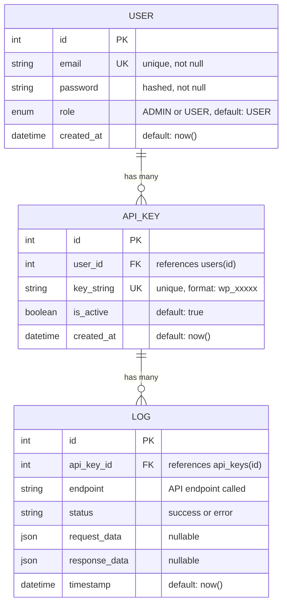

## Entity Relationship Diagram



## Table Details

### users

Table untuk menyimpan data user yang register ke sistem.

| Column | Type | Constraints | Description |
|--------|------|-------------|-------------|
| `id` | INTEGER | PRIMARY KEY, AUTO INCREMENT | Unique identifier untuk user |
| `email` | VARCHAR | UNIQUE, NOT NULL | Email user untuk login |
| `password` | VARCHAR | NOT NULL | Password yang sudah di-hash dengan bcrypt |
| `role` | ENUM | DEFAULT 'USER' | Role user (ADMIN atau USER) |
| `created_at` | TIMESTAMP | DEFAULT NOW() | Waktu pembuatan akun |

**Indexes:**
- PRIMARY KEY: `id`
- UNIQUE: `email`

**Relations:**
- One-to-Many dengan `api_keys` (satu user bisa punya banyak API keys)

### api_keys

Table untuk menyimpan API keys yang di-generate oleh user.

| Column | Type | Constraints | Description |
|--------|------|-------------|-------------|
| `id` | INTEGER | PRIMARY KEY, AUTO INCREMENT | Unique identifier untuk API key |
| `user_id` | INTEGER | FOREIGN KEY, NOT NULL | Reference ke `users.id` |
| `key_string` | VARCHAR | UNIQUE, NOT NULL | String API key (format: wp_xxxxx) |
| `is_active` | BOOLEAN | DEFAULT TRUE | Status aktif/tidak API key |
| `created_at` | TIMESTAMP | DEFAULT NOW() | Waktu pembuatan API key |

**Indexes:**
- PRIMARY KEY: `id`
- UNIQUE: `key_string`
- INDEX: `user_id`

**Relations:**
- Many-to-One dengan `users` (foreign key `user_id`)
- One-to-Many dengan `logs` (satu API key bisa punya banyak logs)

**Constraints:**
- ON DELETE CASCADE: jika user dihapus, semua API keys miliknya juga terhapus

### logs

Table untuk menyimpan request logs dari penggunaan API.

| Column | Type | Constraints | Description |
|--------|------|-------------|-------------|
| `id` | INTEGER | PRIMARY KEY, AUTO INCREMENT | Unique identifier untuk log |
| `api_key_id` | INTEGER | FOREIGN KEY, NOT NULL | Reference ke `api_keys.id` |
| `endpoint` | VARCHAR | NOT NULL | API endpoint yang dipanggil |
| `status` | VARCHAR | NOT NULL | Status request (success/error) |
| `request_data` | JSON | NULLABLE | Data request yang dikirim |
| `response_data` | JSON | NULLABLE | Data response yang dikembalikan |
| `timestamp` | TIMESTAMP | DEFAULT NOW() | Waktu request dibuat |

**Indexes:**
- PRIMARY KEY: `id`
- INDEX: `api_key_id`
- INDEX: `timestamp DESC` (untuk sorting logs terbaru)

**Relations:**
- Many-to-One dengan `api_keys` (foreign key `api_key_id`)

**Constraints:**
- ON DELETE CASCADE: jika API key dihapus, semua logs miliknya juga terhapus

## Prisma Schema

```prisma
generator client {
  provider = "prisma-client-js"
}

datasource db {
  provider = "postgresql"
  url      = env("DATABASE_URL")
}

enum Role {
  ADMIN
  USER
}

model User {
  id        Int      @id @default(autoincrement())
  email     String   @unique
  password  String
  role      Role     @default(USER)
  createdAt DateTime @default(now()) @map("created_at")
  
  apiKeys   ApiKey[]
  
  @@map("users")
}

model ApiKey {
  id        Int      @id @default(autoincrement())
  userId    Int      @map("user_id")
  keyString String   @unique @map("key_string")
  isActive  Boolean  @default(true) @map("is_active")
  createdAt DateTime @default(now()) @map("created_at")
  
  user      User     @relation(fields: [userId], references: [id], onDelete: Cascade)
  logs      Log[]
  
  @@index([userId])
  @@map("api_keys")
}

model Log {
  id           Int      @id @default(autoincrement())
  apiKeyId     Int      @map("api_key_id")
  endpoint     String
  status       String
  requestData  Json?    @map("request_data")
  responseData Json?    @map("response_data")
  timestamp    DateTime @default(now())
  
  apiKey       ApiKey   @relation(fields: [apiKeyId], references: [id], onDelete: Cascade)
  
  @@index([apiKeyId])
  @@index([timestamp(sort: Desc)])
  @@map("logs")
}
```

## Relationship Details

### User to ApiKey (1:N)

- **Cardinality:** One-to-Many
- **Description:** Satu user dapat memiliki banyak API keys
- **Foreign Key:** `api_keys.user_id` → `users.id`
- **Delete Behavior:** CASCADE (jika user dihapus, semua API keys ikut terhapus)

**Use Case:**
- User dapat generate multiple API keys untuk berbagai aplikasi
- Setiap API key terikat ke satu user owner

### ApiKey to Log (1:N)

- **Cardinality:** One-to-Many
- **Description:** Satu API key dapat memiliki banyak request logs
- **Foreign Key:** `logs.api_key_id` → `api_keys.id`
- **Delete Behavior:** CASCADE (jika API key dihapus, semua logs ikut terhapus)

**Use Case:**
- Setiap kali API key digunakan untuk send email, request di-log
- User dapat melihat history penggunaan untuk setiap API key

## Data Flow Example

### User Registration & API Key Generation

```
1. User Register
   └─> INSERT INTO users (email, password, created_at)
       VALUES ('user@example.com', '$2b$10$hashedpassword', NOW())
   
2. Generate API Key
   └─> INSERT INTO api_keys (user_id, key_string, is_active, created_at)
       VALUES (1, 'wp_abc123xyz', true, NOW())

3. Send Email Request
   └─> INSERT INTO logs (api_key_id, endpoint, status, request_data, response_data, timestamp)
       VALUES (1, '/api/send-receipt', 'success', '{"item":"Laptop","harga":"5000000"}', '{"emailId":"re_123"}', NOW())
```

### Query Examples

**Get all API keys for a user:**
```sql
SELECT * FROM api_keys 
WHERE user_id = 1 
AND is_active = true
ORDER BY created_at DESC;
```

**Get all logs for a user's API keys:**
```sql
SELECT l.* 
FROM logs l
JOIN api_keys ak ON l.api_key_id = ak.id
WHERE ak.user_id = 1
ORDER BY l.timestamp DESC;
```

**Check API key validity:**
```sql
SELECT ak.id, ak.is_active, u.email
FROM api_keys ak
JOIN users u ON ak.user_id = u.id
WHERE ak.key_string = 'wp_abc123xyz';
```

## Database Migrations

### Initial Migration

```sql
-- Create role enum
CREATE TYPE "Role" AS ENUM ('ADMIN', 'USER');

-- Create users table
CREATE TABLE users (
    id SERIAL PRIMARY KEY,
    email VARCHAR(255) UNIQUE NOT NULL,
    password VARCHAR(255) NOT NULL,
    role "Role" DEFAULT 'USER',
    created_at TIMESTAMP DEFAULT CURRENT_TIMESTAMP
);

-- Create api_keys table
CREATE TABLE api_keys (
    id SERIAL PRIMARY KEY,
    user_id INTEGER NOT NULL REFERENCES users(id) ON DELETE CASCADE,
    key_string VARCHAR(255) UNIQUE NOT NULL,
    is_active BOOLEAN DEFAULT true,
    created_at TIMESTAMP DEFAULT CURRENT_TIMESTAMP
);

CREATE INDEX idx_api_keys_user_id ON api_keys(user_id);

-- Create logs table
CREATE TABLE logs (
    id SERIAL PRIMARY KEY,
    api_key_id INTEGER NOT NULL REFERENCES api_keys(id) ON DELETE CASCADE,
    endpoint VARCHAR(255) NOT NULL,
    status VARCHAR(50) NOT NULL,
    request_data JSONB,
    response_data JSONB,
    timestamp TIMESTAMP DEFAULT CURRENT_TIMESTAMP
);

CREATE INDEX idx_logs_api_key_id ON logs(api_key_id);
CREATE INDEX idx_logs_timestamp ON logs(timestamp DESC);
```

## Data Integrity Rules

1. **Email Uniqueness:** Setiap email harus unique dalam table `users`
2. **API Key Uniqueness:** Setiap `key_string` harus unique dalam table `api_keys`
3. **Password Security:** Password harus di-hash sebelum disimpan (bcrypt, 10 rounds)
4. **Role Assignment:** User pertama yang register otomatis dapat role ADMIN, sisanya USER
5. **Cascade Delete:** 
   - Jika user dihapus → semua API keys dihapus
   - Jika API key dihapus → semua logs dihapus
6. **Foreign Key Integrity:** `user_id` dan `api_key_id` harus exist di parent table
7. **Default Values:**
   - `role` default `USER`
   - `is_active` default `true`
   - `created_at` & `timestamp` default `NOW()`

## Performance Considerations

1. **Indexes:**
   - `users.email`: Untuk fast lookup saat login
   - `api_keys.user_id`: Untuk fast JOIN dengan users
   - `api_keys.key_string`: Untuk fast validation saat API request
   - `logs.api_key_id`: Untuk fast JOIN dengan api_keys
   - `logs.timestamp`: Untuk fast sorting logs terbaru

2. **JSON Fields:**
   - `request_data` dan `response_data` menggunakan JSON type
   - Flexible schema untuk berbagai jenis request/response
   - Bisa di-query menggunakan JSON operators jika diperlukan

3. **Pagination:**
   - Logs endpoint harus implement pagination untuk menghindari load data berlebihan
   - Recommended: limit 50-100 logs per page

---

*Generated: 2026-01-12*  
*Database: PostgreSQL with Prisma ORM*
