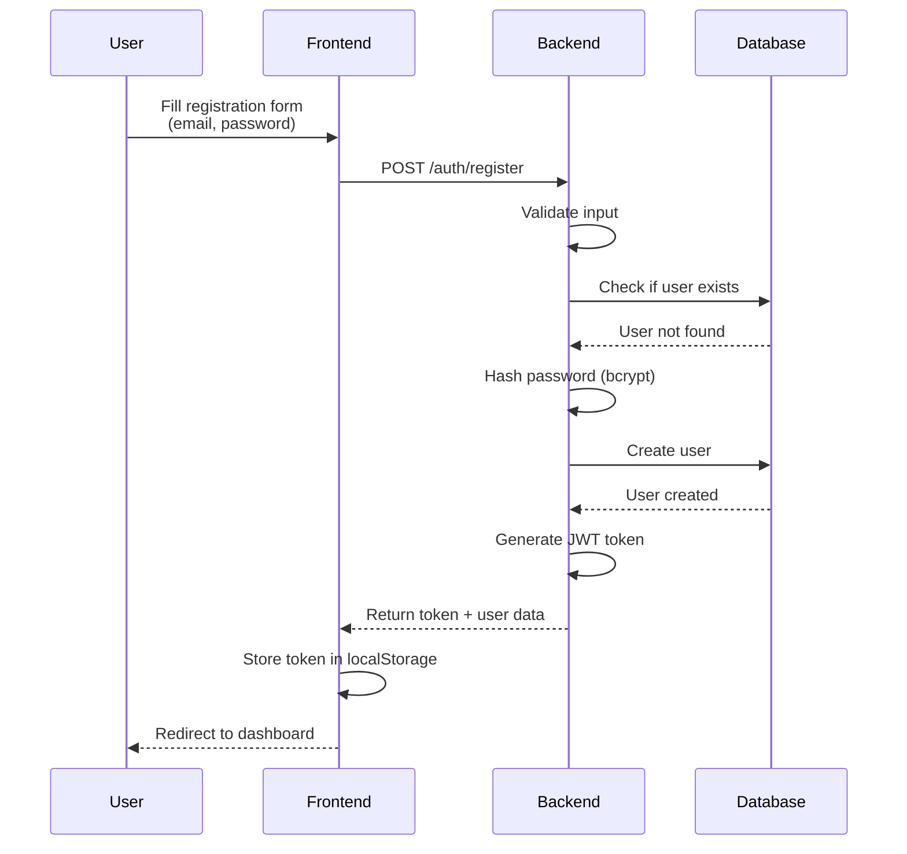
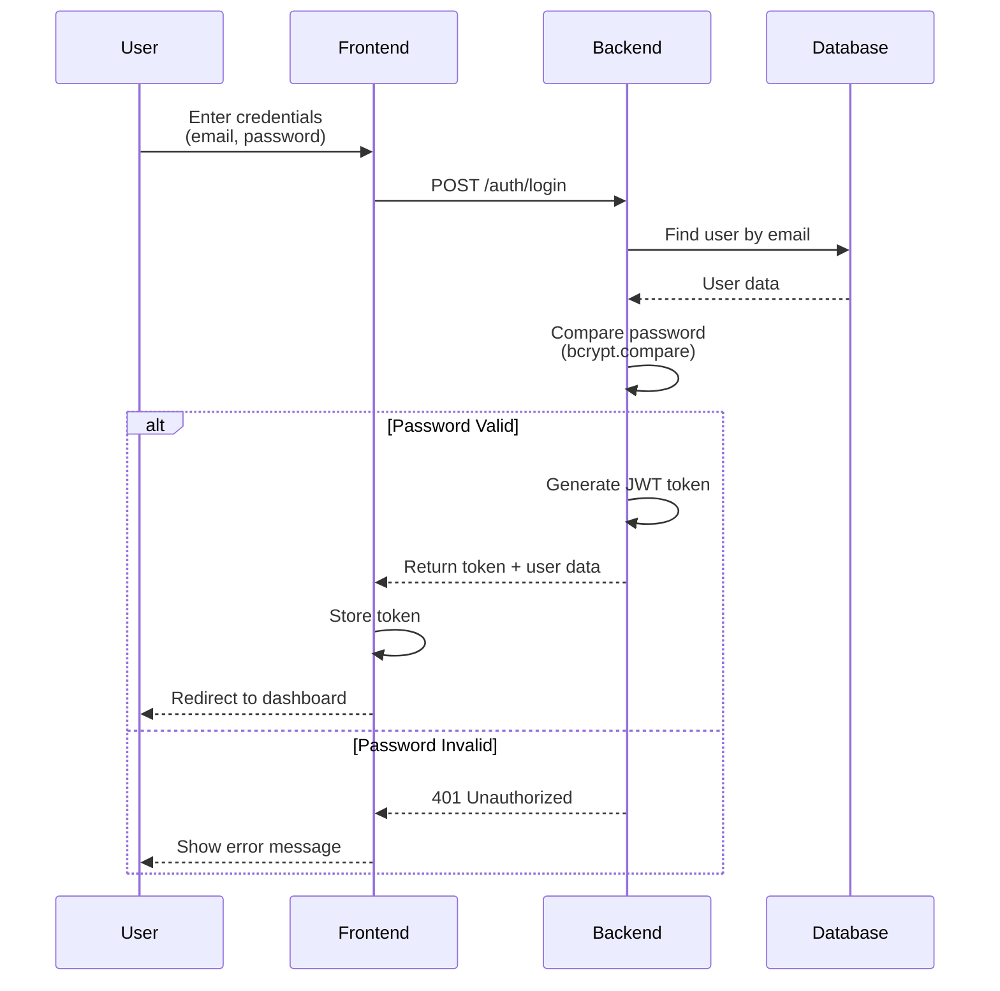
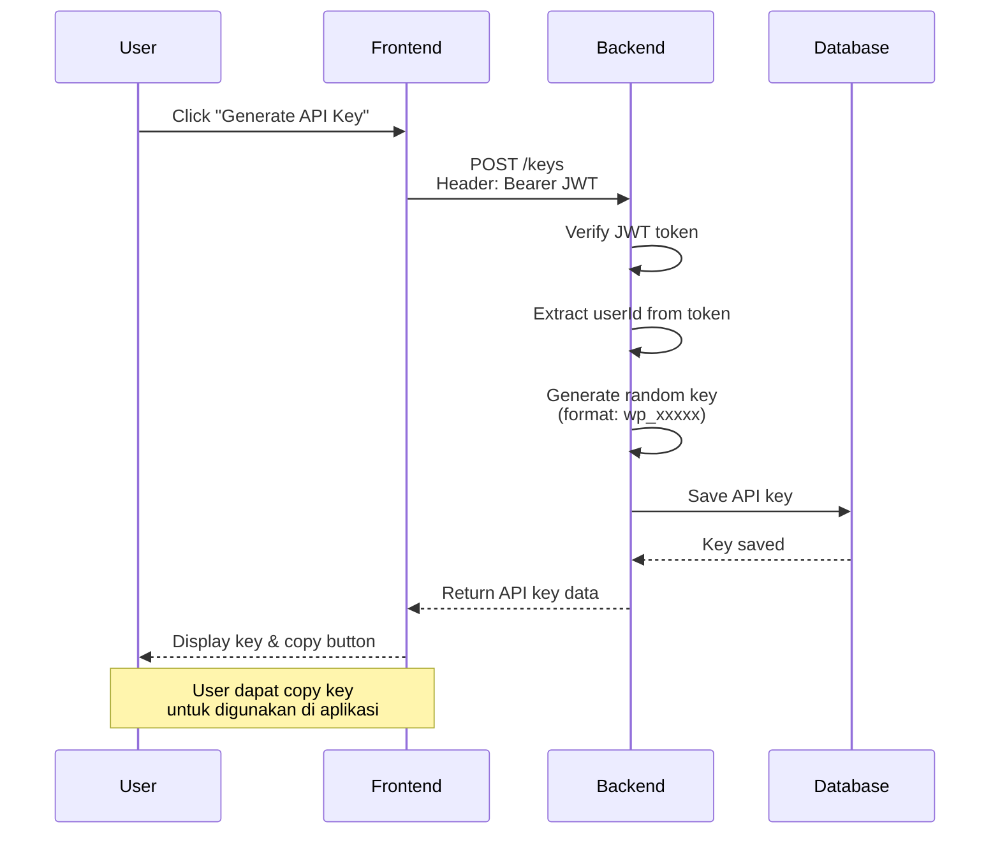
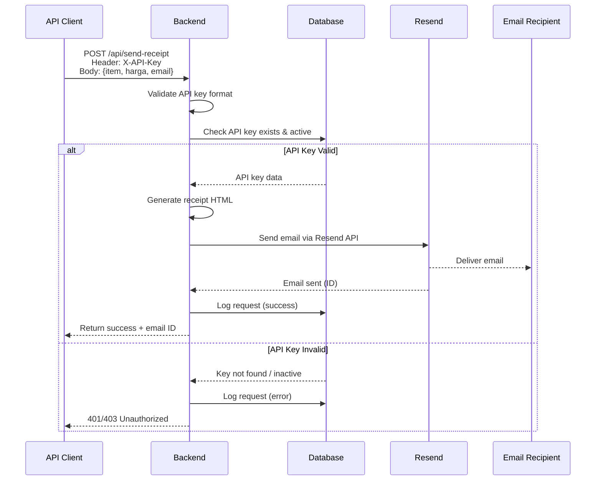
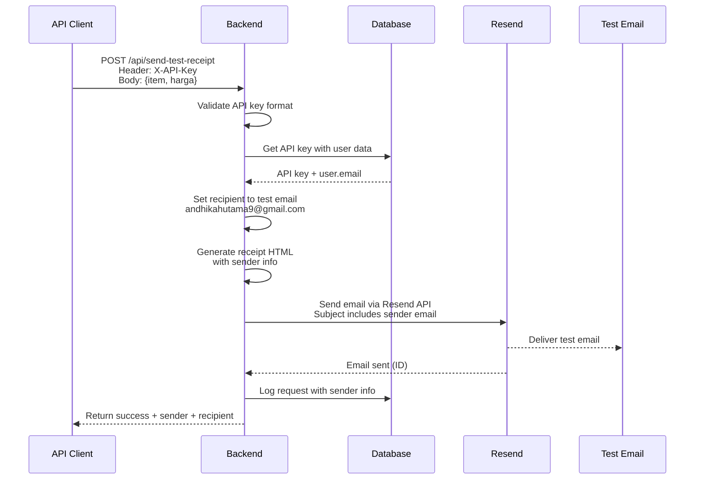
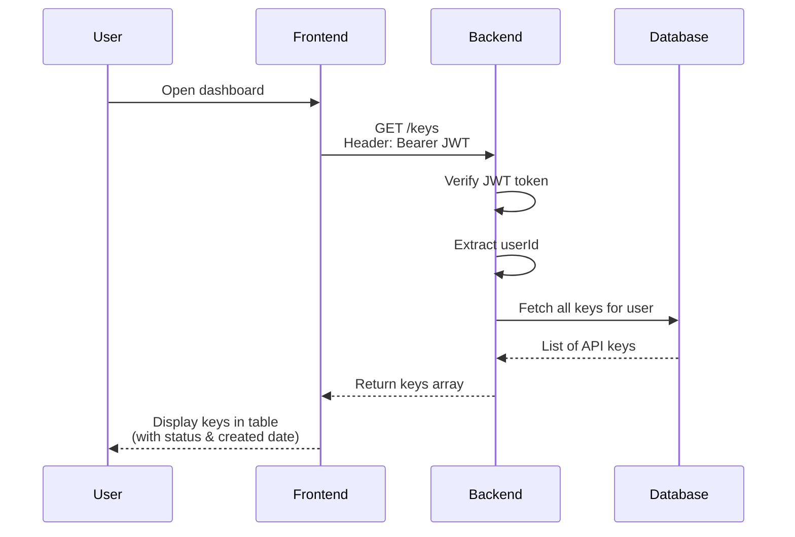
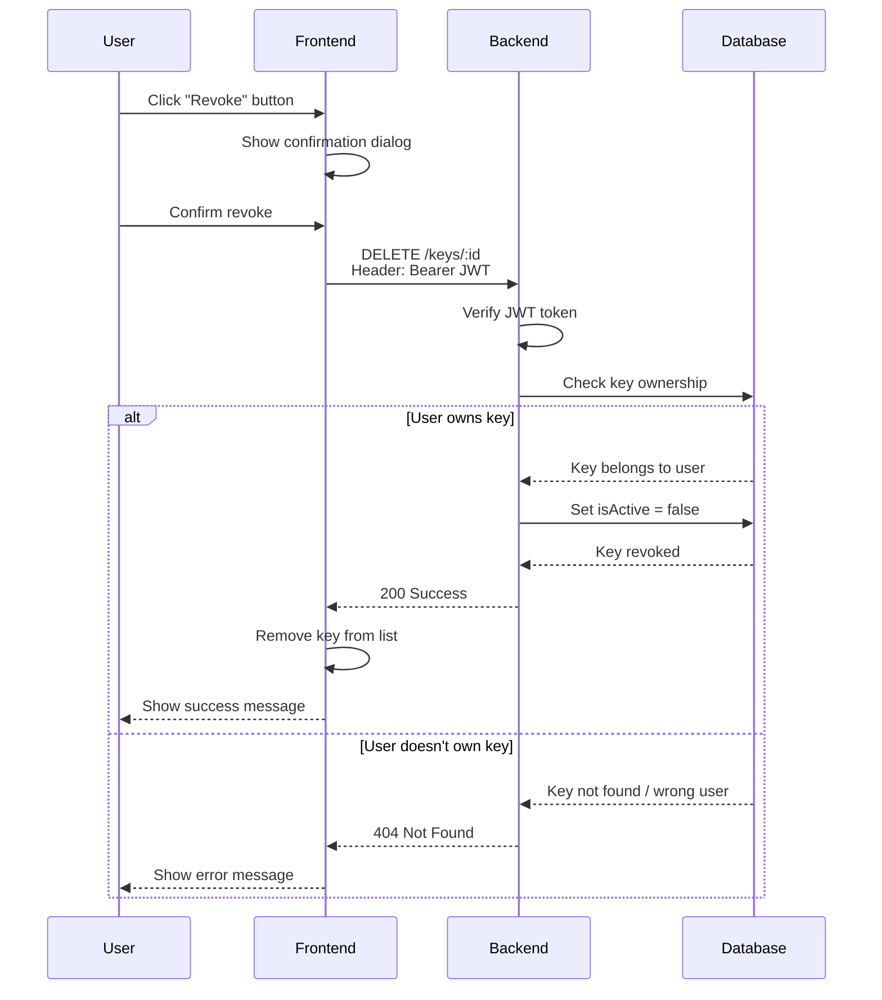
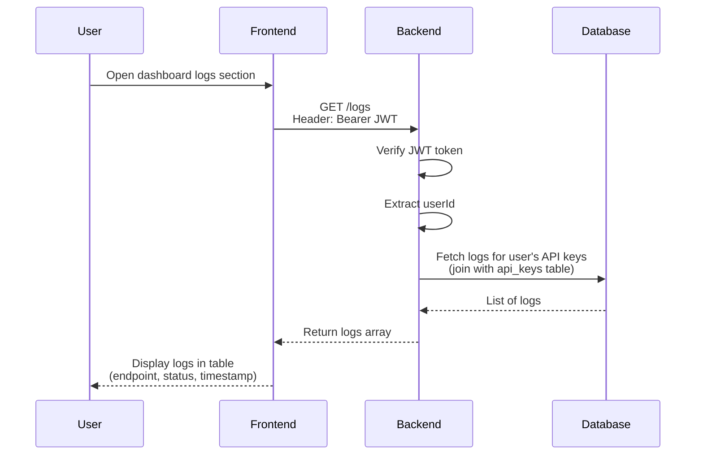

## 1. User Registration Flow

**Steps:**
1. User mengisi form registrasi dengan email dan password
2. Frontend mengirim POST request ke `/auth/register`
3. Backend validasi input dan cek apakah email sudah terdaftar
4. Password di-hash menggunakan bcrypt (10 rounds)
5. User baru dibuat di database
6. JWT token di-generate dengan payload `{ userId, email }`
7. Token dan data user dikembalikan ke frontend
8. Frontend menyimpan token dan redirect ke dashboard

## 2. User Login Flow

**Steps:**
1. User memasukkan email dan password
2. Frontend mengirim POST request ke `/auth/login`
3. Backend mencari user berdasarkan email
4. Password diverifikasi menggunakan `bcrypt.compare()`
5. Jika valid, JWT token di-generate
6. Token dikembalikan ke frontend
7. Frontend menyimpan token dan redirect ke dashboard
8. Jika invalid, error 401 dikembalikan

## 3. API Key Generation Flow

**Steps:**
1. User klik tombol "Generate API Key" di dashboard
2. Frontend mengirim POST request ke `/keys` dengan JWT token di header
3. Backend verifikasi JWT token dan extract userId
4. Random API key di-generate dengan format `wp_` + random string
5. API key disimpan di database dengan status `isActive: true`
6. API key dikembalikan ke frontend
7. Frontend menampilkan key dengan tombol copy

## 4. Email Sending Flow (Main Endpoint)

**Steps:**
1. API client mengirim POST request dengan API key di header
2. Backend validasi format API key (harus diawali `wp_`)
3. Backend cek ke database apakah key exists dan active
4. Jika valid, HTML receipt di-generate dari template
5. Email dikirim via Resend API
6. Request di-log ke database (termasuk request & response data)
7. Success response dikembalikan dengan email ID
8. Jika key invalid, error 401/403 dikembalikan

## 5. Test Email Sending Flow (Auto-detect Sender)

**Steps:**
1. API client mengirim POST request (tanpa field `email`)
2. Backend validasi API key dan retrieve user data dari database
3. Recipient email di-set ke hardcoded test email
4. Sender email di-ambil dari API key owner (`user.email`)
5. HTML receipt di-generate dengan info sender
6. Email subject include sender email
7. Email dikirim via Resend
8. Request di-log dengan info sender dan recipient
9. Response include sender & recipient info

## 6. Fetch API Keys Flow

**Steps:**
1. User membuka halaman dashboard
2. Frontend request GET `/keys` dengan JWT token
3. Backend verifikasi token dan extract userId
4. Semua API keys untuk user tersebut di-fetch dari database
5. List keys dikembalikan ke frontend
6. Frontend menampilkan keys dalam bentuk tabel

## 7. Revoke API Key Flow

**Steps:**
1. User klik tombol "Revoke" pada API key
2. Confirmation dialog muncul
3. Setelah konfirmasi, DELETE request dikirim ke `/keys/:id`
4. Backend verifikasi JWT dan cek ownership
5. Jika user adalah pemilik key, `isActive` di-set ke `false`
6. Success response dikembalikan
7. Frontend update UI dengan remove key dari list
8. Jika bukan pemilik, error 404 dikembalikan

## 8. Fetch Request Logs Flow

**Steps:**
1. User membuka section logs di dashboard
2. Frontend request GET `/logs` dengan JWT token
3. Backend verifikasi token dan extract userId
4. Logs di-fetch dengan JOIN ke table `api_keys` untuk filter by userId
5. Logs diurutkan berdasarkan timestamp (descending)
6. List logs dikembalikan ke frontend
7. Frontend menampilkan dalam bentuk tabel dengan detail request/response

---

*Generated: 2026-01-12*  
*Tech Stack: Astro + Elysia.js + Prisma + PostgreSQL + Resend*
