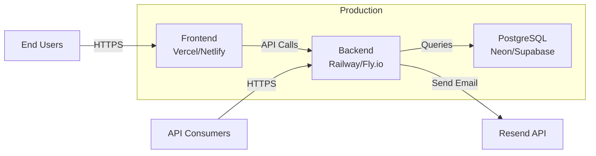

## Architecture Diagram

```mermaid
graph TB
    subgraph "Client Layer"
        User[User Browser]
    end

    subgraph "Frontend - Astro App :4321"
        Index[Landing Page<br/>index.astro]
        Login[Login Page<br/>login.astro]
        Register[Register Page<br/>register.astro]
        Dashboard[Dashboard<br/>dashboard.astro]
        Docs[API Docs<br/>docs.astro]
        Layout[Layout Component]
        CodeSnippet[CodeSnippet Component]
    end

    subgraph "Backend - Elysia.js on Bun :3000"
        Server[Elysia Server<br/>index.ts]
        
        subgraph "Routes"
            AuthRoute[Auth Routes<br/>/auth]
            APIKeyRoute[API Key Routes<br/>/keys]
            EmailRoute[Email Routes<br/>/api]
            LogsRoute[Logs Routes<br/>/logs]
        end
        
        subgraph "Middleware"
            AuthMiddleware[JWT Auth Middleware]
            CORSMiddleware[CORS Middleware]
        end
        
        subgraph "Templates"
            ReceiptTemplate[Receipt HTML Template]
        end
        
        Swagger[Swagger Documentation<br/>/swagger]
    end

    subgraph "External Services"
        Resend[Resend API<br/>Email Service]
        Database[PostgreSQL<br/>Neon/Supabase/Railway]
    end

    %% User interactions
    User -->|Browse| Index
    User -->|Login| Login
    User -->|Register| Register
    User -->|Manage Keys| Dashboard
    User -->|View Docs| Docs

    %% Frontend to Backend
    Login -->|POST /auth/login| AuthRoute
    Register -->|POST /auth/register| AuthRoute
    Dashboard -->|GET /keys<br/>POST /keys<br/>DELETE /keys/:id| APIKeyRoute
    Dashboard -->|GET /logs| LogsRoute
    Docs -->|iframe| Swagger

    %% Server flow
    Server --> AuthRoute
    Server --> APIKeyRoute
    Server --> EmailRoute
    Server --> LogsRoute
    Server --> Swagger
    Server --> CORSMiddleware
    Server --> AuthMiddleware

    %% API Key usage
    External[External API Client] -->|POST /api/send-receipt<br/>Header: X-API-Key| EmailRoute
    External -->|POST /api/send-test-receipt<br/>Header: X-API-Key| EmailRoute

    %% Email sending flow
    EmailRoute -->|Generate HTML| ReceiptTemplate
    EmailRoute -->|Send Email| Resend
    Resend -->|Email Delivery| Recipient[Email Recipient]

    %% Database interactions
    AuthRoute <-->|User CRUD| Database
    APIKeyRoute <-->|API Key Management| Database
    EmailRoute <-->|Log Requests| Database
    LogsRoute <-->|Fetch Logs| Database

    %% Styling
    classDef frontend fill:#60a5fa,stroke:#1e40af,color:#fff
    classDef backend fill:#34d399,stroke:#065f46,color:#000
    classDef database fill:#f59e0b,stroke:#92400e,color:#000
    classDef external fill:#ec4899,stroke:#831843,color:#fff
    classDef middleware fill:#a78bfa,stroke:#5b21b6,color:#fff

    class Index,Login,Register,Dashboard,Docs,Layout,CodeSnippet frontend
    class Server,AuthRoute,APIKeyRoute,EmailRoute,LogsRoute,Swagger,ReceiptTemplate backend
    class Database database
    class Resend,External,Recipient external
    class AuthMiddleware,CORSMiddleware middleware
```



## Component Details

### Frontend (Astro - Port 4321)

| Component | Path | Description |
|-----------|------|-------------|
| Landing Page | `/` | Homepage dengan informasi produk |
| Login | `/login` | Halaman autentikasi user |
| Register | `/register` | Halaman registrasi user baru |
| Dashboard | `/dashboard` | Manajemen API keys dan logs |
| API Docs | `/docs` | Dokumentasi API via iframe Swagger |

**Tech Stack:**
- Framework: Astro
- Styling: Tailwind CSS
- Runtime: Bun

### Backend (Elysia.js - Port 3000)

| Route | Endpoint | Auth | Description |
|-------|----------|------|-------------|
| **Auth** | `POST /auth/register` | None | Registrasi user baru |
| | `POST /auth/login` | None | Login dan generate JWT |
| **API Keys** | `GET /keys` | JWT | List semua API keys user |
| | `POST /keys` | JWT | Generate API key baru |
| | `DELETE /keys/:id` | JWT | Revoke API key |
| **Email** | `POST /api/send-receipt` | API Key | Kirim receipt email |
| | `POST /api/send-test-receipt` | API Key | Test endpoint (auto sender) |
| **Logs** | `GET /logs` | JWT | Fetch request logs |

**Tech Stack:**
- Framework: Elysia.js
- Runtime: Bun
- ORM: Prisma
- Email: Resend
- Auth: JWT (@elysiajs/jwt)
- Docs: Swagger (@elysiajs/swagger)

### Database (PostgreSQL)

**Provider Options:**
- Neon
- Supabase
- Railway
- Any PostgreSQL compatible service

**ORM:** Prisma

## Deployment Architecture



## Authentication & Authorization

### JWT Authentication (User endpoints)
- **Used for:** `/keys`, `/logs`
- **Header:** `Authorization: Bearer <jwt_token>`
- **Payload:** `{ userId, email }`
- **Expiry:** 7 days

### API Key Authentication (Public endpoints)
- **Used for:** `/api/send-receipt`, `/api/send-test-receipt`
- **Header:** `X-API-Key: wp_xxxxxxxxxxxxx`
- **Format validation:** Must start with `wp_`
- **Database validation:** Must exist and be active

## Environment Configuration

### Backend (.env)
```env
DATABASE_URL=postgresql://...
RESEND_API_KEY=re_xxxxx
JWT_SECRET=your-secret-key
FROM_EMAIL=onboarding@resend.dev
PORT=3000
```

### Frontend (.env)
```env
PUBLIC_API_URL=http://localhost:3000
```

## Security Features

| Feature | Implementation | Location |
|---------|---------------|----------|
| Password Hashing | bcrypt (10 rounds) | `routes/auth.ts` |
| JWT Tokens | @elysiajs/jwt (7d expiry) | `index.ts`, `middleware/` |
| CORS Protection | @elysiajs/cors | `index.ts` |
| API Key Format | Pattern validation (wp_) | `utils/apiKey.ts` |
| Request Logging | All API calls logged | `routes/email.ts` |
| Cascade Delete | Prisma relations | `schema.prisma` |

## Key Features

- User Management: Register, login dengan JWT
- API Key Management: Generate, list, revoke keys
- Email Sending: Send receipt emails via Resend
- Request Logging: Track all API usage
- API Documentation: Auto-generated Swagger docs
- Test Endpoint: Send test receipt dengan auto-detect sender
- Error Handling: Comprehensive error responses
- Type Safety: TypeScript di backend dan frontend

---

*Generated: 2026-01-12*  
*Tech Stack: Astro + Elysia.js + Prisma + PostgreSQL + Resend*
